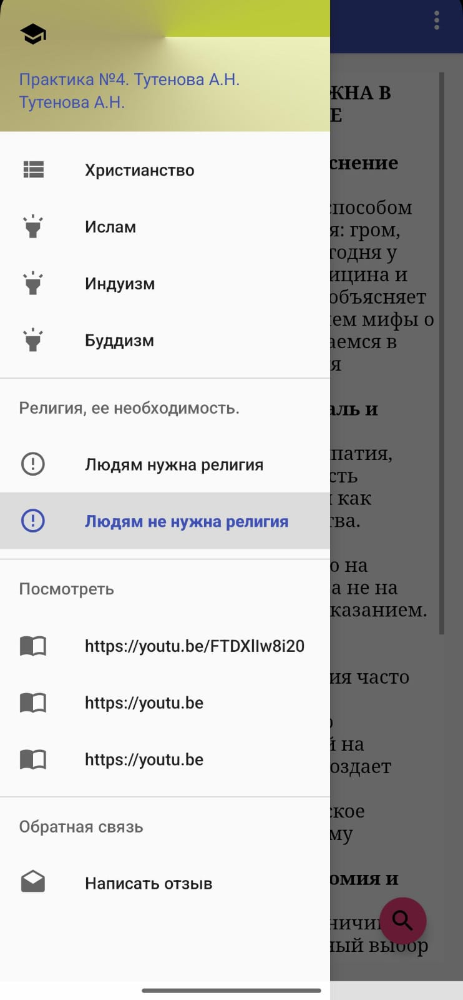

# EBook tan_lab04
Электронная книга




# tan_lab04

An Android e-book application about world religions.

## Features
- 📖 Offline HTML content (Christianity, Islam, Buddhism, etc.)
- 🔍 Full-text search within articles
- ⚙️ Customizable font size and settings
- 📱 Navigation drawer for easy topic access

## Tech Stack
- **Language:** Java
- **IDE:** Android Studio
- **Components:** WebView, SharedPreferences, NavigationView

## How to Run
1. Clone the repository:
   ```bash
   git clone https://github.com/yourusername/tan_lab04.git
   ```
2. Open the project in **Android Studio** and click **Run**.

---
*Educational project.*
