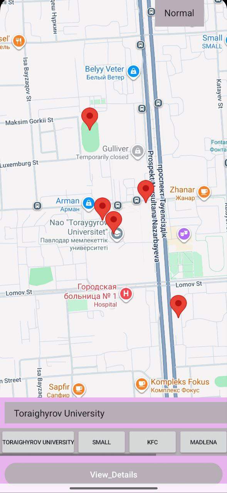

# My District Maps

# tan_lab05



## Overview

This Android application provides an interactive map of a specific district using the **Google Maps API**. Built with **Java**, it allows users to explore key locations marked on the map. Clicking on a marker reveals detailed information about each place, making it a useful guide for local navigation.

## Key Features

- **Google Maps Integration:** Full-screen interactive map view.
- **Custom Markers:** Pre-defined locations pinned across the district.
- **Info Windows:** Tap on any marker to view name and description details.
- **User-Friendly:** Simple interface focused on map interaction.

## Technologies

- **Language:** Java
- **Platform:** Android (Android Studio)
- **API:** Google Maps Android API

## Setup Instructions

1. **Get API Key:** Generate a key from the [Google Cloud Console](https://console.cloud.google.com/).
2. **Add Key:** Open `AndroidManifest.xml` and replace `YOUR_API_KEY` with your actual key:
   ```xml
   <meta-data
       android:name="com.google.android.geo.API_KEY"
       android:value="YOUR_API_KEY"/>
   ```
3. **Run:** Build the project in Android Studio and deploy to a device or emulator.

## Usage

Launch the app to view the district map. Scroll to find markers and tap them to read more about each location.
