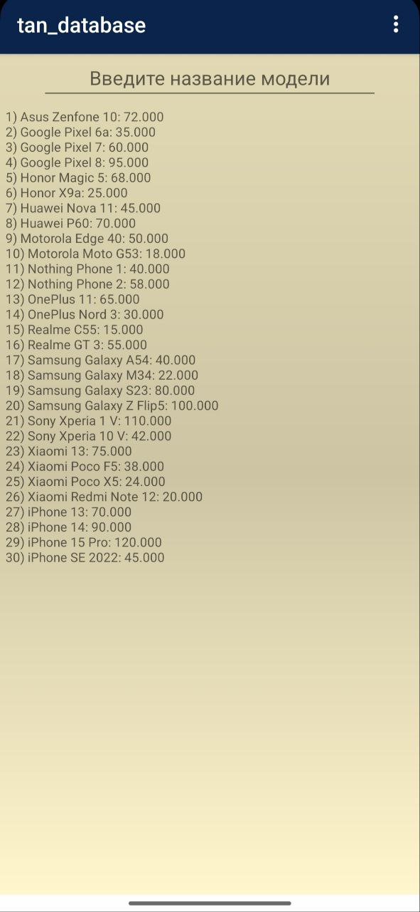

# Android Phone Catalog

# tan_lab06

## Description

A simple Android reference application built with **Java** and **SQLite**. This app allows users to browse a list of smartphones and search for specific models based on their budget or name.

## Features

- **SQLite Database:** Local storage for phone data.
- **Smart Search:**
  - **Text Search:** Finds models by partial name (e.g., "iPhone" finds "iPhone 15").
  - **Numeric Search:** Finds phones within a price range (e.g., enters "50000" shows phones ≥ 50,000).
- **Data:** Includes 30+ popular phone models with current prices.

## Tech Stack

- **Language:** Java
- **Database:** SQLite
- **IDE:** Android Studio

## Usage

1. Open the project in Android Studio.
2. Build and run on an emulator or physical device.
3. Select a search field (Model or Price) from the dropdown.
4. Enter your search term and click **Find**.

## License

This project is created for educational purposes.
